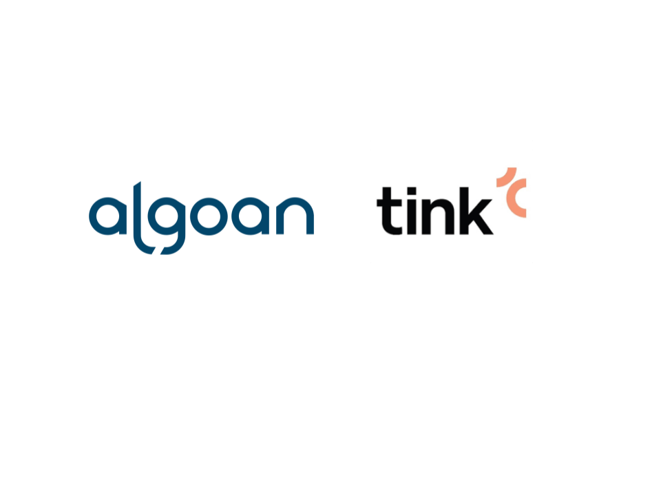

<p align="center">
  <a href="http://algoan.com/" target="blank"></a>
</p>


# Algoan NestJS Tink connector

A simple connector using [NestJS](https://nestjs.com/) framework to connect your service to [Tink](https://tink.com/).

## Description

[Nest](https://github.com/nestjs/nest) framework TypeScript starter repository for Algoan connectors.

## About Algoan and Tink

- [Algoan](https://www.algoan.com) helps companies to build the best open banking experience for credits. To see our products, please refer to our official website
- [Tink](https://tink.com) is a swedish banking data aggregator for financial services.

## Goal and philosophy

A connector is a web software able to connect a provider to Algoan's API. It subscribes to REST Hooks which lets Algoan notifying the connector when a specific event happens.

The **`nestjs-tink-connector`** focuses on a user bank accounts and transactions. The main goal of this connector is to be able to retrieve a user bank data when Algoan wishes to.

## Listened subscriptions

This section describes the process required for each subscription for an aggregator connector.

### Aggregator Link Required

<!-- To complete -->

### Bank Details Required

<!-- To complete -->
## Application Structure

- `config/`: stores all configurations for the application. It uses [node-config-ts](https://github.com/tusharmath/node-config-ts) to generate a type definition of the `default.json` file.
- `src/algoan/`: Algoan module getting your service accounts. It uses the [@algoan/rest](https://github.com/algoan/rest-nodejs) library.
- `src/hooks/`: Entry point for your [RestHook](https://developers.algoan.com/public/docs/algoan_documentation/resthooks_and_events/resthooks.html) called by Algoan. It handles [events](https://developers.algoan.com/public/docs/algoan_documentation/resthooks_and_events/event_list.html) you've subscribed to.
- `test/`: contains e2e tests.

## Contributing

We would love to have your contribution, thank you for that! 🎉

If you want to add missing APIs, or correct an issue, you will have to follow this list of instructions.

### Instructions

- Set up your local environment by forking the repository.
- When you are about to commit, [commitlint](https://github.com/conventional-changelog/commitlint) is running to check if your commit message respects [conventional commit](https://www.conventionalcommits.org/en/v1.0.0/).
- Write tests, there is a high coverage on the repository. Simply run `npm run test:cov` to generate a `coverage/` directory.
- Respect [coding style](#code-style). Run `npm run lint` to check if there are errors.
- Open a Pull Request where you describe the feature/issue you are about to publish.

### Code Style

This project uses [ESLint](https://eslint.org/) to analyze the TypeScript code. Commit are linted too thanks to [commitlint](https://github.com/conventional-changelog/commitlint) and the [conventional commit format](https://conventionalcommits.org/).

## Installation

```bash
$ npm install
```

## Running the app

```bash
# development
$ npm run start

# watch mode
$ npm run start:dev

# production mode
$ npm run start:prod
```

## Test

```bash
# unit tests
$ npm run test

# e2e tests
$ npm run test:e2e

# test coverage
$ npm run test:cov
```

## Support

If you need credentials for your service, please contact support@algoan.com.
